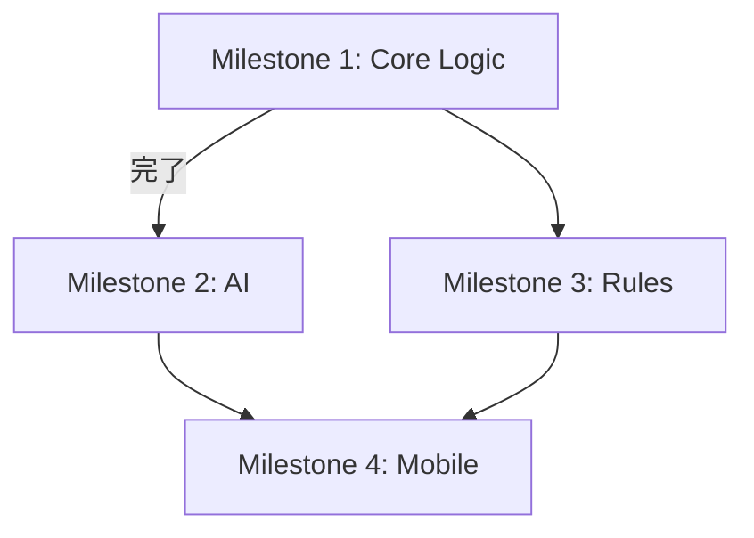

# Variant Go Platform - 実装ロードマップ

## プロジェクト概要

**目標:** Android対応の、多様な変則ルールと多様なAIを対戦させることができるボードゲームプラットフォーム

**技術スタック:**
- 言語: Python 3.x
- GUI: Flet（クロスプラットフォーム対応）
- テスト: Pytest
- ターゲット: Android（将来）

---

## マイルストーン全体像

```
┌─────────────────────────────────────────────────────────────────────────────┐
│  Milestone 1: コアロジック構築 ✅ 完了                                        │
│  ├── Model/View分離の基盤                                                   │
│  ├── Observerパターン実装                                                   │
│  └── 標準五目並べルール                                                      │
├─────────────────────────────────────────────────────────────────────────────┤
│  Milestone 2: AI基盤 ✅ 完了                                                 │
│  ├── Human vs CPU / CPU vs CPU                                              │
│  ├── AIインターフェース設計                                                  │
│  └── Random / Minimax / MCTS 実装                                           │
├─────────────────────────────────────────────────────────────────────────────┤
│  Milestone 3: ルールエンジン化 ✅ 完了                                        │
│  ├── Strategyパターン完全適用                                                │
│  ├── ルールプラグイン機構                                                    │
│  └── 変則ルール追加（重力付き、オセロ風など）                                  │
├─────────────────────────────────────────────────────────────────────────────┤
│  Milestone 4: モバイル化 ⏳ GUI完了 / Androidビルド未                         │
│  ├── Flet GUI実装 ✅                                                         │
│  ├── レスポンシブUI ✅                                                        │
│  └── Android APKビルド ⏳                                                     │
└─────────────────────────────────────────────────────────────────────────────┘
```

---

## Milestone 1: コアロジック構築 ✅ 完了

### 実装済み成果物

| ファイル | 内容 |
|---------|------|
| `game_core.py` | コアロジック（Board, GameRule, GameEngine） |
| `test_game_core.py` | ユニットテスト（43件） |

### 実装済みクラス構成

```
Stone (Enum)           - 石の状態
GameStatus (Enum)      - ゲーム状態
Position (DataClass)   - 座標
GameEvent (DataClass)  - イベント通知用データ
Board                  - 盤面状態管理
GameRule (ABC)         - ルール抽象基底クラス
StandardGomokuRule     - 標準五目並べ実装
GameEngine             - ゲーム進行管理 + Observer
```

### 設計上の決定事項
- `GameEngine.board`プロパティはコピーを返す（外部からの直接変更防止）
- リスナーの例外はキャッチしてゲーム進行に影響させない
- `move_history`でUndo機能の基盤を準備済み

---

## Milestone 2: AI基盤 ✅ 完了

### 実装済み成果物

| ファイル | 内容 |
|---------|------|
| `players.py` | Player, HumanPlayer, AIPlayer, GameSession |
| `ai_strategies.py` | AIStrategy, RandomAI, MinimaxAI, MCTSAI |
| `test_players.py` | プレイヤーテスト（28件） |
| `test_ai_strategies.py` | AI戦略テスト（27件） |
| `test_integration.py` | 統合テスト（12件） |

### 2.1 目標
- 人間 vs CPU、CPU vs CPU の対戦モード実装
- AIの強さを切り替え可能にする
- 非同期処理でUIがブロックされないようにする

### 2.2 実装タスク

#### Phase 2.1: プレイヤー抽象化
```python
# 新規ファイル: players.py

class Player(ABC):
    """プレイヤーの抽象基底クラス"""
    @abstractmethod
    async def get_move(self, engine: GameEngine) -> Position:
        """次の手を決定する（非同期）"""
        pass

class HumanPlayer(Player):
    """人間プレイヤー（GUIからの入力を待つ）"""
    pass

class AIPlayer(Player):
    """AIプレイヤー（AIStrategyを使用）"""
    def __init__(self, strategy: AIStrategy):
        self.strategy = strategy
```

#### Phase 2.2: AI戦略インターフェース
```python
# 新規ファイル: ai_strategies.py

class AIStrategy(ABC):
    """AI戦略の抽象基底クラス（Strategyパターン）"""

    @property
    @abstractmethod
    def name(self) -> str:
        """戦略名"""
        pass

    @property
    @abstractmethod
    def difficulty(self) -> str:
        """難易度表示用"""
        pass

    @abstractmethod
    def select_move(self, board: Board, rule: GameRule, stone: Stone) -> Position:
        """最善手を選択"""
        pass
```

#### Phase 2.3: AI実装（段階的）

| 優先度 | AI種類 | 難易度 | 実装概要 |
|--------|--------|--------|----------|
| 1 | RandomAI | Easy | 合法手からランダム選択 |
| 2 | MinimaxAI | Medium | Minimax + Alpha-Beta枝刈り |
| 3 | MCTSAI | Hard | Monte Carlo Tree Search |

**RandomAI（必須・最初に実装）**
```python
class RandomAI(AIStrategy):
    def select_move(self, board, rule, stone):
        valid_moves = rule.get_valid_moves(board, stone)
        return random.choice(valid_moves)
```

**MinimaxAI（探索深度で強さ調整）**
- 評価関数: 連続石数のスコアリング
- Alpha-Beta枝刈りで高速化
- 探索深度: 3〜5程度（調整可能）

**MCTSAI（最強）**
- UCB1によるノード選択
- ランダムプレイアウト
- 時間制限またはシミュレーション回数制限

#### Phase 2.4: ゲームコントローラ拡張
```python
# game_core.py に追加または新規ファイル

class GameSession:
    """ゲームセッション管理（プレイヤー管理含む）"""

    def __init__(self, rule: GameRule, black_player: Player, white_player: Player):
        self.engine = GameEngine(rule)
        self.players = {Stone.BLACK: black_player, Stone.WHITE: white_player}

    async def run_game(self):
        """ゲームループを非同期で実行"""
        while not self.engine.is_game_over:
            current_player = self.players[self.engine.current_turn]
            move = await current_player.get_move(self.engine)
            self.engine.play_move(move.x, move.y)
```

### 2.3 テスト計画
- [ ] RandomAIが常に合法手を返すこと
- [ ] MinimaxAIが1手詰めを逃さないこと
- [ ] CPU vs CPUが正常に終了すること
- [ ] 非同期処理のタイムアウト処理

### 2.4 成果物
```
players.py          - Player, HumanPlayer, AIPlayer
ai_strategies.py    - AIStrategy, RandomAI, MinimaxAI, MCTSAI
test_ai.py          - AIテスト
```

---

## Milestone 3: ルールエンジン化 ✅ 完了

### 実装済み成果物

| ファイル | 内容 |
|---------|------|
| `game_core.py` | RuleRegistry, GravityGomokuRule追加 |
| `test_game_core.py` | ルールテスト含む（82件） |

### 3.1 目標
- ルールをプラグインのように差し替え可能にする
- 変則ルールの追加を容易にする
- ルール設定のシリアライズ/デシリアライズ

### 3.2 実装タスク

#### Phase 3.1: ルールインターフェース拡張
```python
class GameRule(ABC):
    # 既存メソッド...

    @abstractmethod
    def apply_move_effects(self, board: Board, x: int, y: int, stone: Stone) -> list[Position]:
        """
        着手による副作用を適用（石を取る、重力で落ちるなど）
        Returns: 変化があった座標リスト
        """
        pass

    @abstractmethod
    def get_rule_config(self) -> dict:
        """ルール設定を辞書で返す（シリアライズ用）"""
        pass

    @classmethod
    @abstractmethod
    def from_config(cls, config: dict) -> "GameRule":
        """設定からルールを復元（デシリアライズ用）"""
        pass
```

#### Phase 3.2: 変則ルール実装

| ルール名 | 概要 | 実装ポイント |
|----------|------|-------------|
| GravityGomoku | 石が下に落ちる | `apply_move_effects`で重力処理 |
| ForbiddenGomoku | 三三・四四・長連禁止 | `is_valid_move`で禁じ手判定 |
| Connect6 | 六目並べ（2手ずつ） | 手番管理の変更 |
| CaptureGomoku | 挟んで取れる | `apply_move_effects`で捕獲処理 |
| TorusGomoku | 端がループ | `Board`の境界処理変更 |

#### Phase 3.3: ルールレジストリ
```python
# rules/registry.py

class RuleRegistry:
    """利用可能なルールを管理"""
    _rules: dict[str, type[GameRule]] = {}

    @classmethod
    def register(cls, rule_class: type[GameRule]):
        cls._rules[rule_class.rule_id] = rule_class

    @classmethod
    def get(cls, rule_id: str) -> type[GameRule]:
        return cls._rules[rule_id]

    @classmethod
    def list_all(cls) -> list[str]:
        return list(cls._rules.keys())
```

### 3.3 ディレクトリ構成（予定）
```
variant_go/
├── core/
│   ├── __init__.py
│   ├── board.py
│   ├── engine.py
│   └── events.py
├── rules/
│   ├── __init__.py
│   ├── base.py           # GameRule ABC
│   ├── registry.py       # RuleRegistry
│   ├── standard.py       # StandardGomokuRule
│   ├── gravity.py        # GravityGomokuRule
│   └── forbidden.py      # ForbiddenGomokuRule
├── players/
│   ├── __init__.py
│   ├── base.py           # Player ABC
│   ├── human.py
│   └── ai.py
├── ai/
│   ├── __init__.py
│   ├── base.py           # AIStrategy ABC
│   ├── random.py
│   ├── minimax.py
│   └── mcts.py
└── tests/
    ├── test_core.py
    ├── test_rules.py
    └── test_ai.py
```

### 3.4 成果物
- ルールプラグイン機構
- 変則ルール2種以上
- ルール設定のJSON保存/読込

---

## Milestone 4: モバイル化 ⏳ GUI完了 / Androidビルド未

### 実装済み成果物

| ファイル | 内容 |
|---------|------|
| `main.py` | Fletアプリのエントリーポイント |
| `ui/__init__.py` | UIモジュール |
| `ui/settings_view.py` | 設定画面（ルール選択、プレイヤー設定） |
| `ui/game_view.py` | ゲーム画面（盤面、ステータス、操作ボタン） |
| `ui/board_component.py` | 盤面コンポーネント（タップ操作対応） |

### 動作確認済み
- `flet run main.py` でデスクトップ動作確認済み
- Human vs Human, Human vs AI, AI vs AI 全て動作
- StandardGomokuRule (15x15) / GravityGomokuRule (7x6) 切り替え動作

### 残作業
- [ ] Android APKビルド (`flet build apk`)
- [ ] モバイル実機テスト

### 4.1 目標
- Flet GUIの実装
- レスポンシブUI（スマホ縦画面対応）
- Android APKビルド

### 4.2 GUI設計

#### 画面構成
```
┌──────────────────────────────────────┐
│  [設定] Variant Go Platform  [履歴] │  ← AppBar
├──────────────────────────────────────┤
│                                      │
│     ┌─────────────────────────┐      │
│     │                         │      │
│     │       盤面表示          │      │  ← 正方形を維持
│     │      (15x15 Grid)       │      │
│     │                         │      │
│     └─────────────────────────┘      │
│                                      │
│  ● 黒の番 (あなた)                   │  ← ステータス表示
│  ○ 持ち時間: --:--                   │
│                                      │
│  [パス] [投了] [新規ゲーム]          │  ← アクションボタン
└──────────────────────────────────────┘
```

#### コンポーネント設計
```python
# ui/components/board_view.py
class BoardView(ft.UserControl):
    """盤面表示コンポーネント"""
    def __init__(self, engine: GameEngine):
        self.engine = engine
        engine.add_listener(self._on_game_event)

    def _on_game_event(self, event: GameEvent):
        """Observerコールバック - UI更新"""
        self.update()

# ui/pages/game_page.py
class GamePage(ft.View):
    """ゲーム画面"""
    pass

# ui/pages/settings_page.py
class SettingsPage(ft.View):
    """設定画面（ルール選択、AI選択）"""
    pass
```

### 4.3 Flet固有の考慮事項
- `ft.Container`でアスペクト比を維持
- タッチ操作用の適切なタップ領域
- 非同期処理は`page.run_task()`を使用
- 状態管理は`page.session`または独自State

### 4.4 ビルド手順
```bash
# 開発時
flet run main.py

# Androidビルド
flet build apk
```

### 4.5 成果物
- Flet GUI一式
- Android APK
- インストール手順書

---

## 優先度と依存関係



**推奨実装順序:**
1. Milestone 2.1-2.2: Player/AI基本構造
2. Milestone 2.3: RandomAI（最小限動作確認）
3. Milestone 4の一部: 基本GUI（Human vs Human）
4. Milestone 2.3続き: MinimaxAI, MCTSAI
5. Milestone 3: ルールエンジン化
6. Milestone 4完成: 全機能統合、Androidビルド

---

## リスクと対策

| リスク | 影響 | 対策 |
|--------|------|------|
| MCTS実装の複雑さ | M2遅延 | RandomAI/Minimaxで先にリリース可能にする |
| Fletの制約 | M4遅延 | 早期にプロトタイプで検証 |
| パフォーマンス問題 | UX低下 | AI計算は別スレッド/プロセスで実行 |
| 変則ルールの複雑さ | M3遅延 | 標準ルール+1種で最小リリース |

---

## 次のアクション（Milestone 4 残作業）

1. [ ] Android APKビルド (`flet build apk`)
2. [ ] モバイル実機テスト
3. [ ] 必要に応じてタッチUI調整
